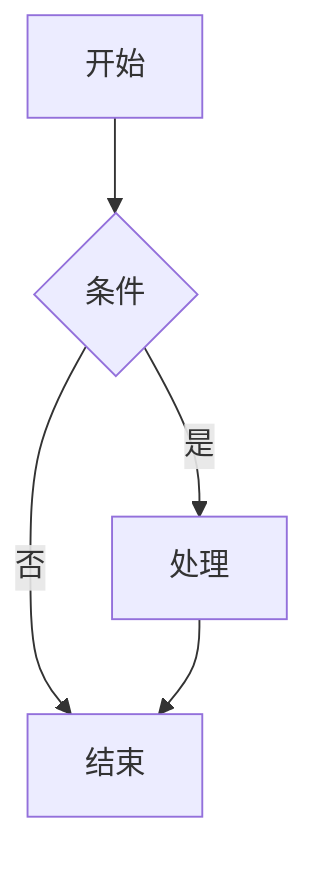

# Quick Start Guide: 在线工具库

**Feature**: 在线工具库
**Version**: 1.0
**Date**: 2025-01-24

## 项目概述

在线工具库是一个基于 Remix 框架构建的纯客户端工具集合，包含 JSON 格式化、Mermaid 图表绘制和 Markdown 预览转换功能。

## 技术栈

- **框架**: Remix 2.8+
- **语言**: TypeScript 5.3+
- **样式**: TailwindCSS 3.4+ + shadcn/ui
- **构建工具**: Vite (Remix内置)
- **测试**: Vitest + React Testing Library

## 环境要求

- Node.js 18.0+
- npm 9.0+ 或 yarn 1.22+
- 现代浏览器 (Chrome 90+, Firefox 88+, Safari 14+)

## 快速开始

### 1. 克隆项目

```bash
git clone <repository-url>
cd tools-remix
```

### 2. 安装依赖

```bash
npm install
# 或
yarn install
```

### 3. 启动开发服务器

```bash
npm run dev
# 或
yarn dev
```

应用将在 `http://localhost:5173` 启动。

### 4. 构建生产版本

```bash
npm run build
# 或
yarn build
```

### 5. 启动生产服务器

```bash
npm run start
# 或
yarn start
```

## 项目结构

```
tools-remix/
├── app/                          # Remix 应用目录
│   ├── routes/                  # 路由文件
│   │   ├── _index.tsx          # 首页
│   │   ├── json.tsx            # JSON工具页
│   │   ├── mermaid.tsx         # Mermaid工具页
│   │   ├── markdown.tsx        # Markdown工具页
│   │   └── api/                # API路由
│   ├── components/              # React组件
│   │   ├── ui/                 # shadcn/ui组件
│   │   ├── layout/             # 布局组件
│   │   └── tools/              # 工具特定组件
│   ├── lib/                    # 工具函数
│   │   ├── json.ts             # JSON处理逻辑
│   │   ├── mermaid.ts          # Mermaid集成
│   │   └── markdown.ts         # Markdown处理
│   └── styles/                  # 样式文件
├── public/                      # 静态资源
├── specs/                       # 规格文档
└── package.json
```

## 功能使用指南

### JSON 工具

访问 `http://localhost:5173/json`

**功能**:
- 粘贴或输入 JSON 字符串
- 自动格式化和美化
- 语法错误检测和提示
- 一键复制格式化结果

**快捷键**:
- `Ctrl/Cmd + Enter`: 格式化
- `Ctrl/Cmd + Shift + C`: 复制结果

### Mermaid 工具

访问 `http://localhost:5173/mermaid`

**支持的图表类型**:
- 流程图 (flowchart)
- 时序图 (sequence)
- 类图 (class)
- 状态图 (state)
- 实体关系图 (er)
- 甘特图 (gantt)
- 饼图 (pie)
- 用户旅程图 (journey)
- Git图 (git)
- 架构图 (architecture)

**基本语法**:


### Markdown 工具

访问 `http://localhost:5173/markdown`

**功能**:
- 实时预览 Markdown 内容
- 转换为 HTML 代码
- 导出为图片文件
- 转换为纯文本

**支持的语法**:
- 标准 Markdown
- GitHub 风格代码块
- 表格
- 任务列表
- 表情符号

## 开发指南

### 添加新工具

1. 创建路由文件:
```typescript
// app/routes/new-tool.tsx
export default function NewTool() {
  return (
    <div>
      <h1>新工具</h1>
      {/* 工具内容 */}
    </div>
  );
}
```

2. 更新工具列表:
```typescript
// app/lib/tools.ts
export const TOOLS = [
  // 现有工具...
  {
    id: 'new-tool',
    name: '新工具',
    description: '工具描述',
    route: '/new-tool',
    icon: 'tool',
  },
];
```

3. 添加导航链接:
```typescript
// app/components/layout/Navigation.tsx
// 在导航菜单中添加新工具链接
```

### 自定义样式

项目使用 TailwindCSS，可以通过以下方式自定义样式：

1. 修改 `tailwind.config.js`:
```javascript
module.exports = {
  content: ["./app/**/*.{js,jsx,ts,tsx}"],
  theme: {
    extend: {
      colors: {
        primary: {
          50: '#eff6ff',
          500: '#3b82f6',
          900: '#1e3a8a',
        },
      },
    },
  },
  plugins: [require('@tailwindcss/forms'), require('@tailwindcss/typography')],
};
```

2. 使用 shadcn/ui 组件:
```bash
# 添加新组件
npx shadcn-ui@latest add button
npx shadcn-ui@latest add input
npx shadcn-ui@latest add card
```

### 测试

运行测试：
```bash
npm run test
# 或
yarn test
```

运行测试覆盖率：
```bash
npm run test:coverage
# 或
yarn test:coverage
```

### 代码质量

项目配置了以下代码质量工具：

1. **ESLint**:
```bash
npm run lint
# 或
yarn lint
```

2. **Prettier**:
```bash
npm run format
# 或
yarn format
```

3. **TypeScript 检查**:
```bash
npm run type-check
# 或
yarn type-check
```

## 部署

### Vercel 部署

1. 安装 Vercel CLI:
```bash
npm i -g vercel
```

2. 部署:
```bash
vercel
```

### 自定义服务器部署

1. 构建项目:
```bash
npm run build
```

2. 启动服务器:
```bash
npm run start
```

3. 配置 Nginx (可选):
```nginx
server {
    listen 80;
    server_name your-domain.com;

    location / {
        proxy_pass http://localhost:3000;
        proxy_http_version 1.1;
        proxy_set_header Upgrade $http_upgrade;
        proxy_set_header Connection 'upgrade';
        proxy_set_header Host $host;
    }
}
```

## 性能优化

### 已实现的优化

1. **代码分割**: 按路由自动分割代码
2. **懒加载**: 按需加载工具库
3. **缓存策略**: 静态资源缓存
4. **防抖处理**: 用户输入防抖
5. **内存管理**: 及时清理临时对象

### 性能监控

应用内置性能监控，可以在控制台查看：

- 页面加载时间
- 工具处理时间
- 内存使用情况
- 错误率统计

## 故障排除

### 常见问题

**Q: 页面加载缓慢**
A: 检查网络连接，清除浏览器缓存，确保 Node.js 版本 >= 18.0

**Q: JSON 格式化失败**
A: 检查 JSON 语法，确保输入不超过 5MB 限制

**Q: Mermaid 图表不显示**
A: 检查图表语法，确保节点数不超过 200 个

**Q: Markdown 图片生成失败**
A: 检查 Markdown 内容大小，确保不超过 500KB 限制

### 调试模式

启用调试模式：
```bash
NODE_ENV=development npm run dev
```

在浏览器控制台查看详细日志信息。

## 贡献指南

1. Fork 项目
2. 创建功能分支: `git checkout -b feature/new-feature`
3. 提交更改: `git commit -am 'Add new feature'`
4. 推送分支: `git push origin feature/new-feature`
5. 创建 Pull Request

## 许可证

本项目采用 MIT 许可证。详见 [LICENSE](LICENSE) 文件。

## 支持

如有问题或建议，请：

1. 查看 [Issues](../../issues) 页面
2. 创建新的 Issue
3. 联系开发团队

---

**注意**: 这是一个纯客户端应用，所有数据处理都在浏览器本地进行，确保用户数据隐私和安全。