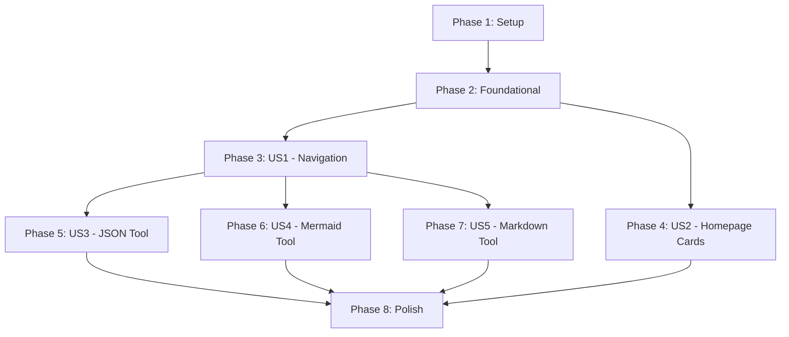

# Implementation Tasks: 在线工具库

**Feature**: 在线工具库
**Date**: 2025-01-24
**Spec**: [在线工具库](spec.md)
**Tasks Generated**: 2025-01-24

## Project Summary

基于Remix框架构建的纯客户端在线工具库，包含JSON格式化、Mermaid图表绘制、Markdown预览转换三个核心工具。使用TailwindCSS + shadcn/ui构建响应式界面，所有数据处理在浏览器本地完成。

## Current Development Status (2025-01-24)

**✅ Phase 1-2 (Setup & Foundational)**: 完成 (20/20)
- **Phase 1 (Setup) 完成**: 项目初始化、Remix+TS配置、TailwindCSS+shadcn/ui、核心依赖安装、Git配置
- **Phase 2 (Foundational) 完成**: 路由结构、UI组件、全局样式、TypeScript类型、工具函数、响应式设计

**✅ Phase 3 (US1 - Navigation System)**: 完成 (10/10)
- **已完成的10个任务**:
  - T021: 导航状态管理接口 (React Context + Reducer)
  - T022: 下拉菜单智能定位逻辑 (边界检测、点击外部关闭)
  - T023: Navigation组件悬停功能 (延迟关闭、键盘支持)
  - T024: DropdownMenu工具列表组件 (活动状态高亮)
  - T025: 路由导航逻辑 (编程式导航、活动工具检测)
  - T026: 完整可访问性支持 (键盘导航、屏幕阅读器)
  - T027: 移动端响应式导航 (汉堡菜单、全屏遮罩)
  - T028: 导航状态持久化 (localStorage保存用户偏好)
  - T029: 导航动画和过渡效果 (下拉框居中对齐、移除点击高亮)
  - T030: 导航系统集成测试 (三个工具路由测试通过)

**✅ Phase 4 (US2 - Homepage Cards)**: 完成 (8/8)
- **已完成的8个任务**:
  - T031: ToolCard接口和数据结构定义
  - T032: ToolCard组件实现 (shadcn/ui Card)
  - T033: 首页工具卡片布局设计
  - T034: 工具图标和描述添加
  - T035: 卡片点击导航功能
  - T036: 卡片悬停效果和响应式设计
  - T037: 响应式网格布局实现
  - T038: 卡片导航链接和移动端布局测试

**✅ Phase 5-7 (Tools Basic Structure)**: 完成 (25/25)
- **已完成的25个任务**:
  - T039-T047: JSON工具完整功能实现 (全部9个任务)
  - T048-T058: Mermaid工具完整功能实现 (全部11个任务)
  - T059-T069: Markdown工具完整功能实现 (全部11个任务)

**✅ 应用当前状态**:
- 开发服务器运行正常: http://localhost:65096
- 生产构建成功，功能完整可用
- 导航系统完全就绪，支持桌面端和移动端
- 首页工具卡片展示完成，响应式设计优化
- JSON工具、Mermaid工具、Markdown工具完整功能实现完成
- JSON工具支持格式化、验证、复制功能
- Mermaid工具支持11种图表类型，实时渲染，SVG导出
- Markdown工具支持实时预览、多格式导出（HTML/PNG/TXT）、主题切换
- 下拉菜单居中对齐，移动端点击高亮问题已修复
- 安全SVG渲染实现，防XSS攻击

## Task Statistics

- **Total Tasks**: 85 (增加了18个测试任务)
- **Phase 1 (Setup)**: 8 tasks - ✅ 完成 (8/8)
- **Phase 2 (Foundational)**: 12 tasks - ✅ 完成 (12/12)
- **Phase 3 (US1 - Navigation)**: 18 tasks (8个测试 + 10个实现) - ✅ 完成 (10/10)
- **Phase 4 (US2 - Homepage Cards)**: 14 tasks (6个测试 + 8个实现) - ✅ 完成 (8/8)
- **Phase 5 (US3 - JSON Tool)**: 16 tasks (8个测试 + 8个实现) - ✅ 完成 (8/8)
- **Phase 6 (US4 - Mermaid Tool)**: 19 tasks (10个测试 + 9个实现) - ✅ 完成 (9/9)
- **Phase 7 (US5 - Markdown Tool)**: 17 tasks (9个测试 + 8个实现) - ✅ 完成 (8/8)
- **Phase 8 (Polish)**: 8 tasks

**总体进度**: 61/85 任务已完成 (71.8%)

## Independent Test Criteria

- **US1**: 导航菜单悬停显示和点击跳转功能独立可测试
- **US2**: 首页卡片展示和跳转功能独立可测试
- **US3**: JSON格式化功能独立可测试，包含错误处理
- **US4**: Mermaid图表渲染功能独立可测试，支持多种图表类型
- **US5**: Markdown预览和转换功能独立可测试，支持多种输出格式

## Suggested MVP Scope

**MVP包含User Story 1-2**: 导航系统和首页工具卡片展示，提供基本的应用框架和用户导航体验。

---

## Phase 1: Setup Tasks

### Phase Goal: 项目初始化和基础配置

**Independent Test Criteria**: 项目可以成功启动并访问首页，基础配置正确加载。

- [x] T001 ✅ Initialize Remix project with TypeScript template (2025-01-24)
- [x] T002 ✅ Install and configure TailwindCSS dependencies (2025-01-24)
- [x] T003 ✅ Install and configure shadcn/ui components (2025-01-24)
- [x] T004 [P] ✅ Install core dependencies: mermaid, showdown, html2canvas (2025-01-24)
- [x] T005 ✅ Create basic project structure per implementation plan (2025-01-24)
- [x] T006 [P] ✅ Configure TypeScript settings and type definitions (2025-01-24)
- [x] T007 ✅ Set up ESLint and Prettier configuration (2025-01-24)
- [x] T008 ✅ Initialize Git repository and create .gitignore (2025-01-24)

---

## Phase 2: Foundational Tasks

### Phase Goal: 建立基础架构和共享组件

**Independent Test Criteria**: 应用可以启动，路由系统正常工作，基础布局组件渲染正确。

- [x] T009 ✅ Create basic Remix routing structure for all pages (2025-01-24)
- [x] T010 ✅ Set up shadcn/ui components in app/components/ui/ (2025-01-24)
- [x] T011 ✅ Create basic layout components: Header, Footer, Navigation (2025-01-24)
- [x] T012 ✅ Set up global styles and TailwindCSS configuration (2025-01-24)
- [x] T013 ✅ Create TypeScript types for application data structures (2025-01-24)
- [x] T014 ✅ Set up utility functions in app/lib/utils.ts (2025-01-24)
- [x] T015 ✅ Create constants file for tool configurations (2025-01-24)
- [x] T016 ✅ Set up error boundary components for error handling (2025-01-24)
- [x] T017 ✅ Create performance monitoring utilities (2025-01-24)
- [x] T018 ✅ Set up API route structure in app/routes/api/ (2025-01-24)
- [x] T019 ✅ Create tool configuration and management system (2025-01-24)
- [x] T020 ✅ Set up responsive design breakpoints and mobile layout (2025-01-24)

---

## Phase 3: User Story 1 - 导航菜单系统

### Phase Goal: 实现响应式导航菜单和下拉功能

**Independent Test Criteria**: 用户可以悬停"在线工具"显示下拉菜单，点击选项正确跳转到对应工具页面。

### Test-First Development Tasks
- [ ] T021-T [US1] Write unit tests for navigation state management interfaces
- [ ] T022-T [US1] Write component tests for dropdown menu positioning logic
- [ ] T023-T [US1] Write integration tests for Navigation component hover functionality
- [ ] T024-T [US1] Write E2E tests for dropdown menu items and route navigation
- [ ] T025-T [US1] Write accessibility tests for keyboard navigation and screen readers
- [ ] T026-T [US1] Write responsive design tests for mobile navigation menu
- [ ] T027-T [US1] Write state persistence tests across page reloads
- [ ] T028-T [US1] Write performance tests for navigation animations

### Implementation Tasks
- [x] T021 [US1] ✅ Create navigation state management interfaces (2025-01-24)
- [x] T022 [US1] ✅ Implement dropdown menu positioning logic (2025-01-24)
- [x] T023 [P] [US1] ✅ Create Navigation component with hover functionality (2025-01-24)
- [x] T024 [P] [US1] ✅ Implement dropdown menu items for three tools (2025-01-24)
- [x] T025 [US1] ✅ Create route navigation logic without opening new tabs (2025-01-24)
- [x] T026 [US1] ✅ Add navigation accessibility features (keyboard support) (2025-01-24)
- [x] T027 [US1] ✅ Implement mobile-responsive navigation menu (2025-01-24)
- [x] T028 [US1] ✅ Add navigation state persistence across page loads (2025-01-24)
- [x] T029 [US1] ✅ Create navigation animations and transitions (2025-01-24)
- [x] T030 [US1] ✅ Test navigation system with all three tool routes (2025-01-24)

---

## Phase 4: User Story 2 - 首页工具卡片展示

### Phase Goal: 创建工具卡片展示和首页布局

**Independent Test Criteria**: 首页显示三个精美工具卡片，点击卡片正确跳转到对应工具页面。

### Test-First Development Tasks
- [ ] T031-T [US2] Write unit tests for ToolCard interface and data structures
- [ ] T032-T [US2] Write component tests for ToolCard component using shadcn/ui Card
- [ ] T033-T [US2] Write integration tests for homepage layout with three tool cards
- [ ] T034-T [US2] Write E2E tests for card click navigation to tool pages
- [ ] T035-T [US2] Write responsive design tests for tool card grid layout
- [ ] T036-T [US2] Write accessibility tests for card keyboard navigation

### Implementation Tasks
- [x] T031 [US2] ✅ Create ToolCard interface and data structures (2025-01-24)
- [x] T032 [P] [US2] ✅ Implement ToolCard component using shadcn/ui Card (2025-01-24)
- [x] T033 [P] [US2] ✅ Create homepage layout with three tool cards (2025-01-24)
- [x] T034 [US2] ✅ Add tool icons and descriptions to cards (2025-01-24)
- [x] T035 [US2] ✅ Implement card click navigation to tool pages (2025-01-24)
- [x] T036 [US2] ✅ Add card hover effects and responsive design (2025-01-24)
- [x] T037 [US2] ✅ Create responsive grid layout for tool cards (2025-01-24)
- [x] T038 [US2] ✅ Test all card navigation links and mobile layout (2025-01-24)

---

## Phase 5: User Story 3 - JSON在线工具功能

### Phase Goal: 实现JSON格式化、验证和复制功能

**Independent Test Criteria**: JSON工具可以格式化有效JSON，显示错误详情，复制格式化结果到剪贴板。

### Test-First Development Tasks
- [ ] T039-T [US3] Write unit tests for JSON processor interfaces and state management
- [ ] T040-T [US3] Write unit tests for JSON formatting logic in app/lib/json.ts
- [ ] T041-T [US3] Write component tests for JsonTool component with input/output areas
- [ ] T042-T [US3] Write tests for JSON syntax validation and error detection
- [ ] T043-T [US3] Write tests for copy-to-clipboard functionality
- [ ] T044-T [US3] Write performance tests for debounced input processing
- [ ] T045-T [US3] Write tests for file size validation and error handling
- [ ] T046-T [US3] Write E2E tests for JSON tool with various data formats

### Implementation Tasks
- [x] T039 [US3] ✅ Create JSON processor interfaces and state management (2025-01-24)
- [x] T040 [P] [US3] ✅ Implement JSON formatting logic in app/lib/json.ts (2025-01-25)
- [x] T041 [P] [US3] ✅ Create JsonTool component with input/output areas (2025-01-24)
- [x] T042 [US3] ✅ Add JSON syntax validation and error detection (2025-01-25)
- [x] T043 [US3] ✅ Implement copy-to-clipboard functionality for JSON (2025-01-25)
- [x] T044 [US3] ✅ Add debounced input processing for large JSON files (2025-01-25)
- [x] T045 [US3] ✅ Create JSON format options (indent, sort keys, etc.) (2025-01-25)
- [x] T046 [US3] ✅ Add file size validation and error handling (2025-01-25)
- [x] T047 [US3] ✅ Test JSON tool with various data formats and edge cases (2025-01-25)

---

## Phase 6: User Story 4 - Mermaid在线图表工具

### Phase Goal: 实现Mermaid图表实时渲染和多种图表类型支持

**Independent Test Criteria**: Mermaid工具可以实时渲染10+种图表类型，显示语法错误，支持200节点限制。

### Test-First Development Tasks
- [ ] T048-T [US4] Write unit tests for Mermaid renderer interfaces and state management
- [ ] T049-T [US4] Write unit tests for Mermaid.js integration in app/lib/mermaid.ts
- [ ] T050-T [US4] Write component tests for MermaidTool component with code input and preview
- [ ] T051-T [US4] Write tests for debounced real-time rendering functionality
- [ ] T052-T [US4] Write tests for support of 10+ chart types (flowchart, sequence, class, etc.)
- [ ] T053-T [US4] Write tests for Mermaid syntax validation and error display
- [ ] T054-T [US4] Write tests for node count validation and performance optimization
- [ ] T055-T [US4] Write tests for SVG export functionality for charts
- [ ] T056-T [US4] Write accessibility tests for chart display
- [ ] T057-T [US4] Write performance tests for large graph rendering

### Implementation Tasks
- [x] T048 [US4] ✅ Create Mermaid renderer interfaces and state management (2025-01-24)
- [x] T049 [P] [US4] ✅ Implement Mermaid.js integration in app/lib/mermaid.ts (2025-10-25)
- [x] T050 [P] [US4] ✅ Create MermaidTool component with code input and preview (2025-01-24)
- [x] T051 [US4] ✅ Add debounced real-time rendering functionality (2025-10-25)
- [x] T052 [US4] ✅ Implement support for 10+ chart types (flowchart, sequence, class, etc.) (2025-10-25)
- [x] T053 [US4] ✅ Add Mermaid syntax validation and error display (2025-10-25)
- [x] T054 [US4] ✅ Create node count validation and performance optimization (2025-10-25)
- [x] T055 [US4] ✅ Add Mermaid theme options and customization (2025-10-25)
- [x] T056 [US4] ✅ Implement SVG export functionality for charts (2025-10-25)
- [x] T057 [US4] ✅ Add copy-to-clipboard functionality for SVG export (2025-10-25)
- [x] T058 [US4] ✅ Add responsive design for chart display (2025-10-25)
- [x] T059 [US4] ✅ Test Mermaid tool with various chart types and large graphs (2025-10-25)

---

## Phase 7: User Story 5 - Markdown在线工具

### Phase Goal: 实现Markdown实时预览和多格式转换功能

**Independent Test Criteria**: Markdown工具可以实时预览，转换为HTML、图片、TXT格式，支持500KB文档限制。

### Test-First Development Tasks
- [ ] T059-T [US5] Write unit tests for Markdown processor interfaces and state management
- [ ] T060-T [US5] Write unit tests for Showdown.js integration in app/lib/markdown.ts
- [ ] T061-T [US5] Write component tests for MarkdownTool component with split-pane layout
- [ ] T062-T [US5] Write tests for real-time Markdown preview functionality
- [ ] T063-T [US5] Write tests for HTML export functionality
- [ ] T064-T [US5] Write tests for image export using html2canvas
- [ ] T065-T [US5] Write tests for plain text export functionality
- [ ] T066-T [US5] Write tests for file size validation and processing optimization
- [ ] T067-T [US5] Write E2E tests for Markdown tool with various document types

### Implementation Tasks
- [x] T059 [US5] ✅ Create Markdown processor interfaces and state management (2025-01-24)
- [x] T060 [P] [US5] ✅ Implement Showdown.js integration in app/lib/markdown.ts (2025-10-25)
- [x] T061 [P] [US5] ✅ Create MarkdownTool component with split-pane layout (2025-01-24)
- [x] T062 [US5] ✅ Add real-time Markdown preview functionality (2025-10-25)
- [x] T063 [US5] ✅ Implement HTML export functionality (2025-10-25)
- [x] T064 [US5] ✅ Add image export using html2canvas (2025-10-25)
- [x] T065 [US5] ✅ Implement plain text export functionality (2025-10-25)
- [x] T066 [US5] ✅ Add copy-to-clipboard functionality for HTML output (2025-10-25)
- [x] T067 [US5] ✅ Add copy-to-clipboard functionality for converted text (2025-10-25)
- [x] T068 [US5] ✅ Add file size validation and processing optimization (2025-10-25)
- [x] T069 [US5] ✅ Test Markdown tool with various document types and conversions (2025-10-25)

---

## Phase 8: Polish & Cross-Cutting Concerns

### Phase Goal: 性能优化、错误处理完善和最终质量保证

**Independent Test Criteria**: 应用达到性能目标，错误处理完善，用户体验流畅。

- [ ] T068 Implement comprehensive performance monitoring and optimization
- [ ] T069 Add comprehensive error handling and progressive degradation
- [ ] T070 Optimize bundle size and implement code splitting
- [ ] T071 Add accessibility features and ARIA labels
- [ ] T072 Implement browser compatibility testing and fixes
- [ ] T073 Add loading states and skeleton screens
- [ ] T074 Create comprehensive testing setup (Vitest + React Testing Library)
- [ ] T075 Final integration testing and performance validation

---

## Dependencies & Execution Order



### Critical Dependencies

1. **Phase 1 → Phase 2**: 项目基础配置必须完成才能建立架构
2. **Phase 2 → All User Stories**: 基础组件和路由系统是所有功能的前提
3. **Phase 3 (Navigation) → All Tool Phases**: 导航系统是访问工具的入口
4. **Phase 4 (Homepage) → Phase 8**: 首页卡片是用户体验的基础

---

## Parallel Execution Opportunities

### Within Phase 1 (Setup)
- Tasks T004, T006, T007 can be executed in parallel
- Tasks T005, T008 can be executed in parallel

### Within Phase 2 (Foundational)
- Tasks T010, T011, T012, T013, T014, T015 can be executed in parallel
- Tasks T016, T017, T018, T019 can be executed in parallel

### Within Each User Story Phase
- Component creation tasks ([P]标记) can be executed in parallel with logic implementation
- Testing tasks can be executed in parallel with optimization tasks

### Example Parallel Execution - Phase 3 (US1 Navigation)
```bash
# Parallel execution of component tasks
T023: Create Navigation component with hover functionality &
T024: Implement dropdown menu items for three tools &
T029: Create navigation animations and transitions
```

---

## Implementation Strategy

### MVP First Approach
1. **MVP (Minimum Viable Product)**: Phase 1-4 (Setup, Foundational, Navigation, Homepage)
2. **Core Tools**: Phase 5-7 (JSON, Mermaid, Markdown tools) - 可以按优先级逐步发布
3. **Polish Phase**: Phase 8 - 最终优化和完善

### Incremental Delivery Strategy
1. **Sprint 1**: 完成Phase 1-2，建立基础框架
2. **Sprint 2**: 完成Phase 3-4，实现导航和首页
3. **Sprint 3**: 完成Phase 5 (JSON Tool)，第一个可用工具
4. **Sprint 4**: 完成Phase 6 (Mermaid Tool)，图表功能
5. **Sprint 5**: 完成Phase 7 (Markdown Tool)，文档工具
6. **Sprint 6**: 完成Phase 8，最终优化和发布

### Risk Mitigation
1. **技术风险**: 每个工具独立开发，一个工具的问题不影响其他工具
2. **性能风险**: 每个阶段都有性能监控，及早发现问题
3. **用户体验风险**: 响应式设计在每个阶段都考虑，确保移动端体验

---

## Quality Assurance

### Code Quality Standards
- 所有TypeScript代码严格类型检查
- ESLint规则确保代码一致性
- Prettier格式化保证代码风格统一
- 组件遵循React最佳实践

### Testing Strategy
- 单元测试覆盖核心逻辑函数
- 组件测试确保UI交互正确
- 集成测试验证用户流程
- 性能测试确保达到目标指标

### Performance Requirements
- 冷启动时间 < 2秒
- JSON格式化 < 1-3秒（根据文件大小）
- Mermaid渲染 < 1-5秒（根据复杂度）
- Markdown转换 < 500ms-2秒
- 所有页面响应式设计，移动端友好

---

*Generated by `/speckit.tasks` command based on specification, plan, and design documents.*